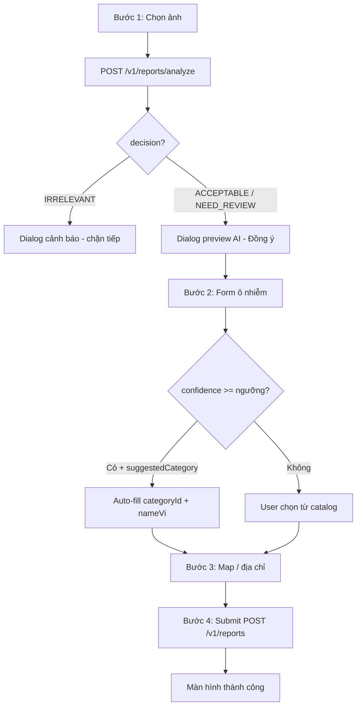

# Luồng tạo báo cáo có AI — Hướng dẫn Frontend (Mobile)

> **Đối tượng:** team Mobile (`green-lens-app`).  
> **Backend:** `greenlens-service` — API thực tế dưới prefix `/v1`.  
> **Envelope:** mọi response `{ code, message, status, data }` (camelCase trong `data`).

---

## 1. Tóm tắt UX (wizard)

User đi theo **4 bước màn hình**. AI chỉ chạy ở bước đầu; ảnh **chưa lưu CDN** cho đến khi Submit thành công.

| Bước FE | Màn hình          | Việc chính                                                          |
| ------- | ----------------- | ------------------------------------------------------------------- |
| **1**   | Chọn / chụp ảnh   | `POST /v1/reports/analyze` → **Dialog** kết quả AI                  |
| **2**   | Thông tin ô nhiễm | **Auto-fill** loại ô nhiễm (+ có thể fill mức độ) nếu AI đủ tin cậy |
| **3**   | Bản đồ / địa chỉ  | GPS, tỉnh/phường, địa chỉ (xem `ADDRESS_MAP_CATALOG_FLOW.md`)       |
| **4**   | Xác nhận & gửi    | `POST /v1/reports` với `tempImageId` + form                         |



---

## 2. Bước 1 — Analyze ảnh + Dialog

### API

```http
POST /v1/reports/analyze
Content-Type: multipart/form-data
```

| Field   | Giá trị             |
| ------- | ------------------- |
| `image` | File ảnh (bắt buộc) |

- Auth: **không bắt buộc** (anonymous OK).
- Giới hạn: ảnh ≤ **20 MB**; định dạng jpeg/png/webp/heic.

### Response 200 — `data`

```json
{
  "tempImageId": "a1b2c3d4-e5f6-7890-abcd-ef1234567890",
  "expiresInSeconds": 900,
  "aiResult": {
    "decision": "ACCEPTABLE_REPORT_IMAGE",
    "reason": "Mapped pollution evidence is strong enough for report workflow.",
    "classify": {
      "primaryClass": "TRASH",
      "confidence": 0.87,
      "severity": "HIGH",
      "imageRelevance": "POLLUTION_LIKELY",
      "pollutionCoverageRatio": 0.43,
      "predictions": [{ "class": "TRASH", "confidence": 0.87, "bboxCount": 3 }],
      "inferenceTimeMs": 120.5,
      "yoloActive": true,
      "sceneClassifierActive": true
    }
  },
  "suggestedCategory": {
    "id": "3fa85f64-5717-4562-b3fc-2c963f66afa6",
    "code": "TRASH",
    "nameVi": "Ô nhiễm rác thải",
    "nameEn": "Trash",
    "iconUrl": null
  }
}
```

| Field               | FE lưu tạm (state / provider)                   |
| ------------------- | ----------------------------------------------- |
| `tempImageId`       | Bắt buộc — gửi lại khi Submit (TTL **15 phút**) |
| `expiresInSeconds`  | Hiển thị countdown / cảnh báo hết hạn           |
| `aiResult`          | Hiển thị dialog; dùng cho auto-fill bước 2      |
| `suggestedCategory` | **Auto-fill bước 2** — đã có sẵn `id` + tên     |

> BE đã map class AI → row trong bảng `pollution_categories`. FE **không** tự đổi `Trash` → `TRASH` hay đoán `categoryId`.

### Dialog sau Analyze — quy tắc UI

| `aiResult.decision`               | Dialog                                   | Nút "Tiếp tục" (→ Bước 2)                        |
| --------------------------------- | ---------------------------------------- | ------------------------------------------------ |
| `ACCEPTABLE_REPORT_IMAGE`         | Hiện loại gợi ý, confidence %, severity  | **Bật**                                          |
| `NEED_MANUAL_REVIEW`              | Cảnh báo "cần xem xét thêm", vẫn cho gửi | **Bật** (khuyến nghị nhắc user kiểm tra lại ảnh) |
| `IRRELEVANT_OR_SUSPECTED_ABUSIVE` | Ảnh không phù hợp / nghi spam            | **Tắt** — chỉ "Chọn ảnh khác"                    |

Nội dung dialog gợi ý (tiếng Việt):

- Tiêu đề: _Kết quả phân tích ảnh_
- Dòng chính: `suggestedCategory?.nameVi` hoặc `primaryClass` nếu không có suggested
- Phụ: `confidence` → `87%`, `severity` → _Mức độ: Cao_
- `reason` từ BE (nếu có)

### Lỗi bước 1

| HTTP | `code` (ví dụ)                 | FE xử lý                                                                                  |
| ---- | ------------------------------ | ----------------------------------------------------------------------------------------- |
| 400  | `FILE_REQUIRED`                | Toast — chưa chọn ảnh                                                                     |
| 413  | —                              | File > 20MB                                                                               |
| 503  | `AI_UNAVAILABLE` / tương đương | "AI tạm thời không khả dụng" — cho user **bỏ qua AI** (luồng manual, xem §8) hoặc thử lại |

---

## 3. Bước 2 — Form ô nhiễm (auto-fill)

### Catalog (khi cần chọn tay)

```http
GET /v1/catalog/pollution-categories
```

`data.items[]`: `{ id, code, nameVi, nameEn, iconUrl }` — chỉ category **đang active**.

### Auto-fill — quy tắc FE (BE không chặn confidence)

Auto-fill khi **đủ tất cả** điều kiện:

1. `aiResult.decision` ∈ `ACCEPTABLE_REPORT_IMAGE` | `NEED_MANUAL_REVIEW`
2. `suggestedCategory != null` (BE đã resolve được `id` trong DB)
3. `aiResult.classify.confidence >= 0.70` ← **ngưỡng product (FE)**; có thể config constant `AI_AUTOFILL_MIN_CONFIDENCE`

Khi auto-fill:

```dart
// ví dụ pseudo-code
if (shouldAutoFill) {
  form.categoryId = data.suggestedCategory.id;
  form.categoryLabel = data.suggestedCategory.nameVi; // "Ô nhiễm rác thải"
  form.severity = mapSeverity(data.aiResult.classify.severity); // HIGH → High
}
```

| Không auto-fill             | FE làm gì                                                |
| --------------------------- | -------------------------------------------------------- |
| `confidence < 0.70`         | Dropdown trống; hint "AI chưa chắc — vui lòng chọn loại" |
| `suggestedCategory == null` | User chọn từ `GET .../pollution-categories`              |
| User đổi tay                | Ghi đè state local — Submit gửi `categoryId` user chọn   |

### Bảng loại ô nhiễm (seed BE)

| `suggestedCategory.code` | `nameVi` (hiển thị) | AI `primaryClass`      |
| ------------------------ | ------------------- | ---------------------- |
| `TRASH`                  | Ô nhiễm rác thải    | `Trash`, `TRASH`       |
| `WASTEWATER`             | Ô nhiễm nước        | `Water`, `WATER`       |
| `SMOKE`                  | Ô nhiễm không khí   | `Smoke`, `SMOKE`       |
| `CHEMICAL`               | Ô nhiễm hóa chất    | `Chemical`, `CHEMICAL` |

### Severity auto-fill (tuỳ chọn cùng confidence)

| AI `classify.severity` | JSON submit `severity` |
| ---------------------- | ---------------------- |
| `LOW`                  | `Low`                  |
| `MEDIUM`               | `Medium`               |
| `HIGH`                 | `High`                 |
| `CRITICAL`             | `Critical`             |

User luôn được sửa trước khi sang bước 3.

### Trường bước 2 (local state, chưa gọi API)

| Field         | Nguồn                                                   |
| ------------- | ------------------------------------------------------- |
| `categoryId`  | Auto-fill `suggestedCategory.id` hoặc user chọn catalog |
| `severity`    | Auto-fill từ AI hoặc user chọn                          |
| `description` | User nhập (optional, max 1000 ký tự)                    |
| `isAnonymous` | Toggle — `false` thì cần Bearer token lúc Submit        |

---

## 4. Bước 3 — Map & địa chỉ

Không gọi API mới cho AI. Dùng catalog địa giới:

- `GET /v1/catalog/provinces`
- `GET /v1/catalog/provinces/{provinceCode}/wards`

Chi tiết: `docs/ADDRESS_MAP_CATALOG_FLOW.md`.

| Field                      | Ghi chú                                  |
| -------------------------- | ---------------------------------------- |
| `latitude`, `longitude`    | Bắt buộc; trong biên VN (8–24, 102–110)  |
| `provinceCode`, `wardCode` | Cùng có hoặc cùng không; `wardCode` 5 số |
| `address`                  | Số nhà / tên đường (optional)            |

---

## 5. Bước 4 — Submit báo cáo

### API (luồng AI — dùng ảnh đã analyze)

```http
POST /v1/reports
Content-Type: application/json
Authorization: Bearer {token}   ← chỉ khi isAnonymous = false
```

**Body (AI flow)** — một trong hai luồng ảnh:

- **AI flow:** có `tempImageId`, **không** gửi `images[]`
- **Manual flow:** có `images[]` URL từ `POST /v1/media/reports/images`, **không** gửi `tempImageId`

```json
{
  "categoryId": "3fa85f64-5717-4562-b3fc-2c963f66afa6",
  "severity": "High",
  "description": "Rác chất đống nghẹt cống",
  "latitude": 10.8195,
  "longitude": 106.6528,
  "address": "123 Đường ABC",
  "wardCode": "26734",
  "provinceCode": "79",
  "isAnonymous": true,
  "tempImageId": "a1b2c3d4-e5f6-7890-abcd-ef1234567890",
  "images": null
}
```

BE sẽ: lấy file temp → upload R2 → tạo report → xóa temp.

### Response 201 — `data` (tóm tắt)

| Field            | Ý nghĩa                                     |
| ---------------- | ------------------------------------------- |
| `id`, `code`     | Mã báo cáo (`RPT-…`)                        |
| `category`       | `{ id, code, nameVi, nameEn, iconUrl }`     |
| `status`         | `Submitted`                                 |
| `slaVerifyDueAt` | Hạn xác minh ~24h                           |
| `aiPending`      | Luồng AI: thường `false` sau khi đã analyze |
| `images`         | Ảnh đã lưu CDN                              |

### Lỗi submit thường gặp

| HTTP | Khi nào                                                                |
| ---- | ---------------------------------------------------------------------- |
| 400  | `tempImageId` hết hạn / không tồn tại                                  |
| 404  | `categoryId` không active                                              |
| 422  | GPS sai, ward/province không khớp, thiếu auth khi `isAnonymous: false` |

---

## 6. State FE cần giữ xuyên wizard

```text
CreateReportSession {
  // Bước 1
  tempImageId: string
  analyzeExpiresAt: DateTime   // now + expiresInSeconds
  aiResult: AiResultDto
  suggestedCategory: PollutionCategoryDto | null

  // Bước 2
  categoryId: Guid
  severity: Severity
  description: string?
  isAnonymous: bool

  // Bước 3
  latitude, longitude: number
  provinceCode?, wardCode?, address?

  // UI flags
  categoryAutoFilled: bool     // true nếu đã auto-fill từ AI
}
```

**Reset session** khi: user đổi ảnh (gọi analyze lại), hết TTL 15 phút, hoặc submit thành công.

---

## 7. Sequence (AI flow đầy đủ)

```text
FE                    BE .NET                 AI Service        R2 / DB
│── analyze (img) ───►│── forward img ───────►│                 │
│◄─ tempId + ai +     │◄─ classify ───────────│                 │
│   suggestedCategory │                       │                 │
│  [Dialog OK]        │                       │                 │
│  [Bước 2 auto-fill] │                       │                 │
│  [Bước 3 map]       │                       │                 │
│── POST /reports ───►│── upload temp ────────────────────────►│
│◄─ 201 report ───────│                       │                 │
```

---

## 8. Luồng dự phòng (không AI / AI lỗi 503)

1. `POST /v1/media/reports/images` (từng ảnh, field `file`, max 10MB/ảnh)
2. `POST /v1/reports` với `images: [{ url, mimeType, sizeBytes }]`, **không** `tempImageId`
3. Bước 2: user **luôn** chọn category từ catalog (không auto-fill)
4. `aiPending: true` trên report — BE có thể chạy AI sau (background)

Chi tiết upload: `docs/CREATE_POLLUTION_REPORT_FLOW.md`.

---

## 9. Checklist tích hợp Mobile

- [ ] Bước 1: multipart field tên **`image`** (không phải `file`)
- [ ] Dialog theo 3 nhánh `decision`
- [ ] Lưu `tempImageId` + countdown 15 phút
- [ ] Bước 2: auto-fill `categoryId` + label `nameVi` khi `confidence >= 0.70` và có `suggestedCategory`
- [ ] Cho phép user sửa category / severity sau auto-fill
- [ ] Bước 3: catalog tỉnh/phường + GPS
- [ ] Submit: `tempImageId` **hoặc** `images`, không gửi cả hai
- [ ] `isAnonymous: false` → gắn Bearer
- [ ] Xử lý 503 analyze → fallback manual hoặc retry

---

## 10. Tham chiếu backend

| Thành phần           | Repo `greenlens-service`                     |
| -------------------- | -------------------------------------------- |
| Analyze              | `ReportsController` → `POST analyze`         |
| Submit               | `ReportsController` → `POST /v1/reports`     |
| Catalog              | `CatalogController` → `pollution-categories` |
| Mapper AI → category | `AiPollutionClassMapper.cs`                  |
| Seed 4 category      | `PollutionCategorySeeder.cs`                 |

_Cập nhật: 2026-05-17 — đồng bộ `suggestedCategory` (id + nameVi) trên analyze response._
