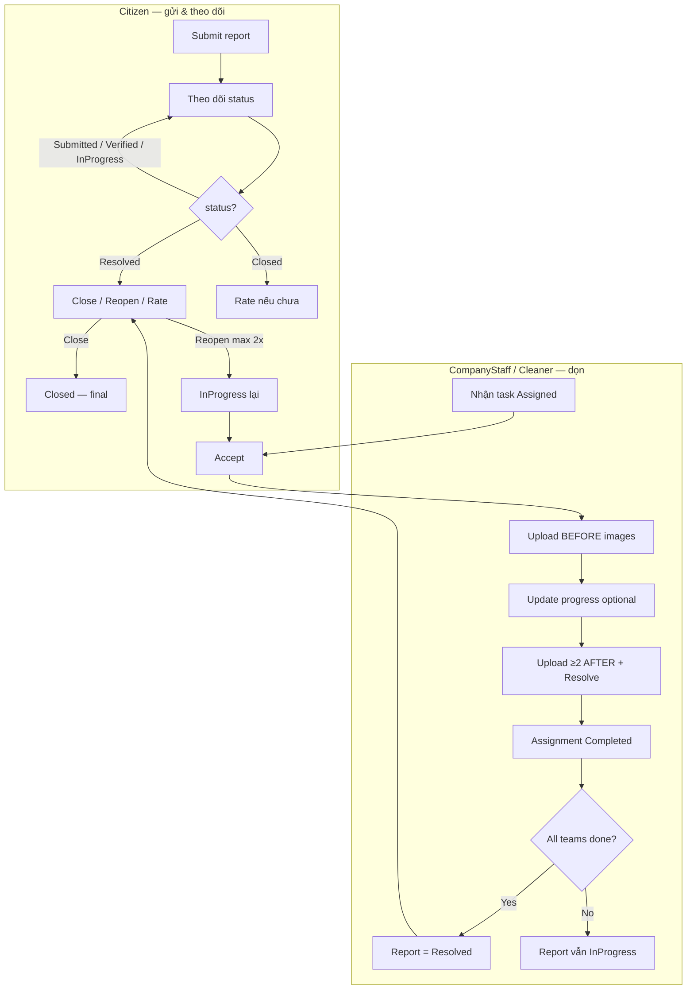

# Mobile Handoff — Citizen + Team dọn dẹp (Full Flow)

> **Audience:** Mobile FE  
> **Mục đích:** Một file duy nhất để implement / refactor UI cho 2 role chính trên app: **Citizen** (người gửi báo cáo) và **CompanyStaff / Cleaner** (team dọn).  
> **Cập nhật:** 2026-07-17 · BE contract hiện tại (+ phần tiếp theo: escalate / rate / map)  
> **Base URL:** `/v1` · Envelope: `{ code, message, status, data }` · Auth: `Bearer {accessToken}`

### Tài liệu chi tiết (nếu cần đào sâu)

| File | Scope |
|------|--------|
| [`mobile-company-staff-task-complete-flow.md`](./mobile-company-staff-task-complete-flow.md) | Team: accept → before → progress → resolve |
| [`mobile-company-staff-before-images-flow.md`](./mobile-company-staff-before-images-flow.md) | Team: bước before-images bắt buộc |
| [`fe-citizen-reports-tab-detail.md`](./fe-citizen-reports-tab-detail.md) | Citizen: list `/reports/my` + close / reopen |
| [`fe-citizen-map-report-detail.md`](./fe-citizen-map-report-detail.md) | Citizen: map pin → detail |
| [`mobile-home-map-list-sheet-api-confirmation.md`](./mobile-home-map-list-sheet-api-confirmation.md) | Citizen: Home map list sheet — BE xác nhận field sẵn |
| [`fe-company-staff-api-guide.md`](./fe-company-staff-api-guide.md) | CompanyStaff API reference |
| [`MOBILE_APP_HANDOFF.md`](./MOBILE_APP_HANDOFF.md) | Account test + seed data |

---

## 0. Big picture — ai làm gì đến đâu?



| Role JWT | Shell Mobile | Kết thúc phần việc trên app |
|----------|--------------|-----------------------------|
| `Citizen` | Citizen | Sau `Closed` (+ rate optional) |
| `CompanyStaff` / `Cleaner` | Field worker | Sau `resolve` → task `Completed` (read-only) |

**Path param luôn là `reportId` (UUID của report), không phải `assignmentId`.**

---

## 1. Account test (seed)

Password chung: **`Lualua123@`**

| Role | Email | Dùng để test |
|------|-------|--------------|
| Citizen | `citizen@greenlens.dev` | Close / reopen / rate — report `REP-MOB-RES001` (Resolved) |
| CompanyStaff (leader) | `staff@greenlens.dev` | Task company `REP-MOB-TSK001` |
| Cleaner (leader) | `cleaner@greenlens.dev` | Task community `REP-MOB-CLN001` |
| Cleaner (member) | `cleaner.member@greenlens.dev` | Chỉ xem — **không** accept/progress/resolve |

---

# PHẦN A — Team dọn (CompanyStaff / Cleaner)

## A1. TL;DR flow chuẩn

```text
1. Login CompanyStaff / Cleaner
2. GET /v1/teams/my-profile              → teamId + isLeader
3. GET /v1/teams/my-tasks                → tab Assigned / InProgress / Completed
4. GET /v1/teams/my-tasks/{reportId}     → detail + flags
5. Leader ACCEPT  (hoặc DECLINE trong 24h)
6. Leader upload BEFORE images           ← bắt buộc trước resolve
7. Leader UPDATE PROGRESS                ← optional, gọi nhiều lần OK
8. Upload ≥ 2 ảnh AFTER → lấy URL
9. Leader RESOLVE
10. Assignment = Completed
    Report = Resolved nếu mọi team active đều Completed
```

## A2. Ai làm được gì?

| Hành động | Member | Team Leader (`is_leader = true`) |
|-----------|--------|----------------------------------|
| Xem list / detail | ✅ | ✅ |
| Accept / Decline | ❌ | ✅ |
| Upload before images | ❌ | ✅ |
| Update progress | ❌ | ✅ |
| Resolve | ❌ | ✅ |

Lấy `isLeader` từ `GET /v1/teams/my-profile`. JWT role `CompanyStaff` **không đủ** — BE check `team_members.is_leader`.

## A3. State machine

### Assignment (team của bạn)

```text
Assigned ──accept──► InProgress ──resolve──► Completed
    │                     │
    │                     └──escalate──► Escalated
    └──decline──► Declined
```

| Status | UI tab gợi ý |
|--------|--------------|
| `Assigned` | Chờ nhận việc |
| `InProgress` | Đang xử lý |
| `Completed` | Đã hoàn thành (read-only) |
| `Declined` | Đã từ chối |
| `Escalated` | Báo vượt khả năng |

### Report (toàn hệ thống)

| Sự kiện | Report status |
|---------|---------------|
| Leader resolve và **mọi** assignment active = `Completed` | → `Resolved` |
| Còn team chưa xong | Vẫn `InProgress` |
| Sau resolve — team **không** mutate thêm | Chỉ xem |

## A4. Flags từ `GET /v1/teams/my-tasks/{reportId}`

| Field | Ý nghĩa UI |
|-------|------------|
| `canDecline` | Hiện nút Từ chối (`Assigned` + còn trong 24h) |
| `canUpdateProgress` | Hiện form cập nhật tiến độ (`InProgress`) |
| `canResolve` | Hiện nút Hoàn thành (`InProgress` **và** đã có before images) |
| `hasBeforeImages` | Đã upload ảnh hiện trạng chưa |
| `beforeImageCount` | Số ảnh before |
| `declineDeadlineAt` | Deadline từ chối |
| `progressRequiredByAt` | Soft SLA: nên update progress mỗi 24h |

**Quy tắc UI:**

- `canResolve === false` + `hasBeforeImages === false` → bắt buộc vào màn Before trước
- Sau `Completed`: tắt mọi nút mutation

## A5. API theo bước

### 1) List tasks

```http
GET /v1/teams/my-tasks?assignmentStatus=Assigned
Authorization: Bearer {token}
```

Query: `assignmentStatus` = `Assigned` | `InProgress` | `Completed` (và pagination nếu có).

### 2) Detail

```http
GET /v1/teams/my-tasks/{reportId}
```

### 3) Accept / Decline

```http
PUT /v1/teams/my-tasks/{reportId}/accept
PUT /v1/teams/my-tasks/{reportId}/decline
```

- Không body  
- Decline chỉ trong **24h** từ `assignedAt` → hết hạn: `DECLINE_WINDOW_EXPIRED`  
- Sau accept → **chuyển thẳng màn Before images** (không resolve ngay)

### 4) Before images (bắt buộc)

```http
POST /v1/reports/{reportId}/before-images
Content-Type: multipart/form-data
```

| Field | Type | Rule |
|-------|------|------|
| `images` | file[] | ≥ 1, ≤ 5 ảnh; mỗi file ≤ 20MB |

Roles: `Cleaner, CompanyStaff, Admin`  
Sau upload: refresh detail → `hasBeforeImages = true`, `canResolve` có thể bật.

### 5) Progress (optional)

```http
PUT /v1/reports/{reportId}/progress
Content-Type: multipart/form-data
```

| Field | Type | Rule |
|-------|------|------|
| `percent` | int | 0–100 |
| `note` | string? | optional |
| `images` | file[]? | optional |

**100% không auto-complete** — vẫn phải gọi resolve riêng.

### 6) Upload after → Resolve

**Bước A — upload từng ảnh lấy URL:**

```http
POST /v1/media/reports/images
Content-Type: multipart/form-data
```

| Field | Type |
|-------|------|
| `file` | 1 file |

Response: lấy **`data.url`** (không phải `data.data.url` nested sai).

**Bước B — hoàn thành:**

```http
PUT /v1/reports/{reportId}/resolve
Content-Type: application/json
```

```json
{
  "afterImageUrls": [
    "https://.../after1.jpg",
    "https://.../after2.jpg"
  ]
}
```

| Rule | Giá trị |
|------|---------|
| Số ảnh after | ≥ 2 |
| Before images | Bắt buộc đã có (≥ 1) |
| Assignment | Phải `InProgress` |
| Actor | Team Leader |

## A6. Lỗi Team thường gặp

| HTTP | `code` | Khi nào |
|------|--------|---------|
| 403 | `FORBIDDEN` | Sai role JWT |
| 404 | `ASSIGNMENT_NOT_FOUND` / `REPORT_NOT_FOUND` | Sai id / không thuộc team |
| 422 | `NOT_TEAM_LEADER` | Member thường gọi mutation |
| 422 | `NOT_TEAM_MEMBER` | Không thuộc team |
| 422 | `ASSIGNMENT_NOT_IN_PROGRESS` | Progress/before khi chưa accept |
| 422 | `INVALID_STATUS_TRANSITION` | Accept/resolve sai status |
| 422 | `DECLINE_WINDOW_EXPIRED` | Decline > 24h |
| 422 | `MISSING_BEFORE_IMAGES` | Resolve thiếu before |
| 422 | `INSUFFICIENT_AFTER_IMAGES` | Resolve < 2 after |
| 400 | `FILE_REQUIRED` | Thiếu file upload |
| 413 | `FILE_TOO_LARGE` | File > 20MB |

## A7. Checklist FE — Team

- [ ] Chỉ hiện Accept/Decline/Progress/Resolve khi `isLeader`
- [ ] Path dùng `reportId`, không `assignmentId`
- [ ] Accept **không** gửi ảnh
- [ ] Sau accept luôn check `hasBeforeImages` → ép màn Before nếu false
- [ ] Before: `POST .../before-images`, field name = `images`
- [ ] Không cho Resolve khi `canResolve === false`
- [ ] Handle `MISSING_BEFORE_IMAGES` → về màn Before
- [ ] After: upload qua `/media/reports/images` field `file`, lấy `data.url`
- [ ] Resolve body: `afterImageUrls` length ≥ 2
- [ ] Disable nút khi đang request; sau mutation → refresh detail
- [ ] Sau `Completed`: UI read-only

---

# PHẦN B — Citizen (User gửi báo cáo)

## B1. TL;DR — sau khi team dọn xong

Khi report = **`Resolved`**, Citizen (chỉ **reporter**) có thể:

| Hành động | API | Status đổi? |
|-----------|-----|-------------|
| Hài lòng → đóng | `PUT /v1/reports/{id}/close` | `Resolved` → `Closed` (final) |
| Chưa hài lòng → mở lại | `PUT /v1/reports/{id}/reopen` | `Resolved` → `InProgress` |
| Đánh giá chất lượng | `POST /v1/reports/{id}/rate` | Không đổi status |
| Không làm gì | Job nền | Sau **7 ngày** → auto `Closed` |

Hai luồng **độc lập**: close/reopen ≠ rate.  
`isSatisfied: false` khi rate **không** tự reopen — FE phải gọi `PUT /reopen` riêng nếu muốn xử lý lại.

## B2. API Citizen cần cho post-resolve

### List báo cáo của tôi

```http
GET /v1/reports/my?page=1&pageSize=20&status=Resolved
```

Item có: `id`, `code`, `categoryName`, `severity`, `status`, `address`, `createdAt`, `resolvedAt`, `closedAt`, `imageUrl`.

### Chi tiết

```http
GET /v1/reports/{id}
```

Field quan trọng cho UI action:

| Field | Dùng để |
|-------|---------|
| `reporterId` | So sánh với user hiện tại (chỉ owner mới action) |
| `status` | `Resolved` / `Closed` / … |
| `reopenedCount` | Ẩn reopen nếu `>= 2` |
| `resolvedAt` | Cửa sổ 7 ngày reopen + countdown auto-close |
| `closedAt` | Hiển thị đã đóng |
| `satisfaction` | `{ isSatisfied, rating, comment, ratedAt }` nếu reporter đã rate |
| `hasCurrentUserRated` | Ẩn form rate nếu `true` |
| `media` | Ảnh citizen + before/after (lọc theo `mediaType`) |

> **BE đã trả** `satisfaction` + `hasCurrentUserRated` (không còn gap cũ trong doc satisfaction).

### Close

```http
PUT /v1/reports/{id}/close
Authorization: Bearer {token}
```

Không body. Chỉ `Resolved` + là reporter.

### Reopen

> ⚠️ **Phần này đã lỗi thời.** Contract hiện hành là `POST /v1/reports/{id}/reopen-requests`
> (bắt buộc lý do ≥ 20 ký tự + 1–5 ảnh minh chứng, tối đa **1** lần thay vì 2, và báo cáo giữ
> nguyên `Resolved` cho tới khi LEO duyệt — không tự chuyển `InProgress`).
> Xem [`fe-reopen-request-flow.md`](./fe-reopen-request-flow.md).

```http
PUT /v1/reports/{id}/reopen
```

Không body. Điều kiện:

- `status === Resolved`
- `reopenedCount < 2`
- Trong **7 ngày** kể từ `resolvedAt`
- Là reporter

Sau thành công: `status → InProgress`, `reopenedCount++`. Team có thể được giao / làm lại phía backend workflow.

### Rate

```http
POST /v1/reports/{id}/rate
Content-Type: application/json
```

```json
{
  "isSatisfied": true,
  "rating": 5,
  "comment": "Đội dọn xử lý nhanh, khu vực sạch sẽ."
}
```

| Field | Type | Bắt buộc | Rule |
|-------|------|----------|------|
| `isSatisfied` | boolean | Có | true/false |
| `rating` | int? | Không | 1–5 nếu gửi |
| `comment` | string? | Không | ≤ 500 ký tự |

Điều kiện: `status ∈ { Resolved, Closed }`, là reporter, **1 lần / report**.

## B3. Flags FE tự tính (không có `canClose` trên response)

```ts
const isOwner = detail.reporterId === currentUser.id;
const within7Days =
  detail.resolvedAt != null &&
  Date.now() - new Date(detail.resolvedAt).getTime() <= 7 * 24 * 60 * 60 * 1000;

const canClose =
  isOwner && detail.status === 'Resolved';

const canReopen =
  isOwner &&
  detail.status === 'Resolved' &&
  detail.reopenedCount < 2 &&
  within7Days;

const canRate =
  isOwner &&
  (detail.status === 'Resolved' || detail.status === 'Closed') &&
  !detail.hasCurrentUserRated;
```

| `status` | Owner? | UI |
|----------|--------|-----|
| `Resolved` | Có | **Đóng** + **Mở lại** (nếu `canReopen`) + **Đánh giá** (nếu `canRate`) |
| `Closed` | Có | Chỉ **Đánh giá** nếu chưa rate |
| Khác | Có | Không hiện block phản hồi kết quả |
| Bất kỳ | Không | Read-only |

### Copy gợi ý

| Action | Confirm |
|--------|---------|
| Đóng | "Xác nhận bạn hài lòng với kết quả? Báo cáo sẽ được đóng." |
| Mở lại | "Báo cáo sẽ được xử lý lại. Bạn còn {2 - reopenedCount} lần mở lại." |
| Đánh giá | "Mỗi báo cáo chỉ đánh giá được một lần." |

### Countdown (optional)

```text
autoCloseAt = resolvedAt + 7 days
Còn X ngày — nếu bạn không phản hồi, hệ thống sẽ tự đóng báo cáo.
```

## B4. Lỗi Citizen thường gặp

| HTTP | `code` | Endpoint | Khi nào |
|------|--------|----------|---------|
| 403 | `NOT_REPORT_OWNER` | close / reopen / rate | Không phải người gửi |
| 404 | `REPORT_NOT_FOUND` | tất cả | ID sai / báo cáo ẩn |
| 422 | `INVALID_STATUS_TRANSITION` | close / reopen / rate | Sai status |
| 422 | `REOPEN_LIMIT_REACHED` | reopen | Đã reopen 2 lần |
| 422 | `REOPEN_WINDOW_EXPIRED` | reopen | Quá 7 ngày từ `resolvedAt` |
| 409 | `ALREADY_RATED` | rate | Đã đánh giá |
| 400 | `VALIDATION_ERROR` | rate | `rating` ngoài 1–5 / comment quá dài |

## B5. Auto-close 7 ngày

- Job: `AutoCloseResolvedReportJob`
- `Resolved` quá 7 ngày không close/reopen → `Closed`
- Citizen vẫn **rate được** khi đã `Closed`
- Có thể nhận push `ReportAutoClosed` (nếu bật notification)

## B6. Checklist FE — Citizen post-resolve

- [ ] Màn detail khi `Resolved`: block “Phản hồi kết quả”
- [ ] Nút Đóng → `PUT .../close` → refetch
- [ ] Nút Mở lại → confirm → `PUT .../reopen` → refetch (ẩn nếu hết lượt / hết 7 ngày)
- [ ] Form rate → `POST .../rate` với `isSatisfied` + optional `rating`/`comment`
- [ ] Ẩn form rate khi `hasCurrentUserRated === true`
- [ ] `Closed`: chỉ còn rate (nếu chưa)
- [ ] Sau close/reopen/rate: invalidate list `GET /reports/my`
- [ ] Hiển thị media `Before` / `After` để citizen so sánh kết quả
- [ ] Không gọi close/reopen nếu không phải owner

## B7. Test cases QA nhanh

| # | Scenario | Expected |
|---|----------|----------|
| 1 | Owner, Resolved, rate lần 1 | 200 + `satisfactionId` |
| 2 | Owner, Resolved, rate lần 2 | 409 `ALREADY_RATED` |
| 3 | Owner, InProgress, rate | 422 |
| 4 | User khác, rate/close | 403 `NOT_REPORT_OWNER` |
| 5 | Owner, Resolved, close | 200 → `Closed` |
| 6 | Owner, Closed, close | 422 |
| 7 | Owner, reopen lần 1 | 200 → `InProgress`, `reopenedCount=1` |
| 8 | `reopenedCount=2`, reopen | 422 `REOPEN_LIMIT_REACHED` |
| 9 | `resolvedAt` > 7 ngày, reopen | 422 `REOPEN_WINDOW_EXPIRED` |
| 10 | Closed (auto), rate chưa | 200 |
| 11 | `isSatisfied: false` không gọi reopen | Status không đổi |

---

# PHẦN C — Sau Resolved: team còn làm gì?

| Actor | Được làm | Không được làm |
|-------|----------|----------------|
| **Team** | Xem task `Completed` / report `Resolved` (read-only) | Accept, before, progress, resolve lại trên assignment đã Completed |
| **Citizen** | Close, Reopen, Rate | — |
| **Hệ thống** | Auto-close 7 ngày | — |

Nếu Citizen **reopen** → report về `InProgress`. Việc giao lại team / làm tiếp do Officer/CM (web) — Mobile team chỉ thấy task mới nếu được assign lại.

---

# PHẦN D — Pseudo-code Mobile (gộp)

## Team (leader)

```ts
// Sau accept
await api.put(`/v1/teams/my-tasks/${reportId}/accept`);

// Before (multipart)
const fd = new FormData();
beforeFiles.forEach(f => fd.append('images', f));
await api.post(`/v1/reports/${reportId}/before-images`, fd);

// After URLs
const afterUrls: string[] = [];
for (const file of afterFiles) {
  const fd = new FormData();
  fd.append('file', file);
  const res = await api.post('/v1/media/reports/images', fd);
  afterUrls.push(res.data.data.url);
}

await api.put(`/v1/reports/${reportId}/resolve`, {
  afterImageUrls: afterUrls, // length >= 2
});
```

## Citizen (owner, status Resolved)

```ts
// Đóng
await api.put(`/v1/reports/${reportId}/close`);

// Mở lại
await api.put(`/v1/reports/${reportId}/reopen`);

// Đánh giá
await api.post(`/v1/reports/${reportId}/rate`, {
  isSatisfied: true,
  rating: 5,
  comment: 'Tốt',
});

// Luôn refetch
await api.get(`/v1/reports/${reportId}`);
```

---

# PHẦN E — Phần tiếp theo của BE (User + Team dọn)

> Contract **core** (accept → before → progress → resolve + close/reopen/rate) ở Phần A–D **đã sẵn trên BE**.  
> Mục này gom **API mở rộng / optional** và **gap FE còn lại** để sprint tiếp theo không lẫn với luồng bắt buộc.

## E1. Trạng thái contract (BE sẵn sàng dùng)

| Hạng mục | Role | BE | Ghi chú FE |
|----------|------|----|-----------|
| `GET /teams/my-profile` + `isLeader` | Team | ✅ | Gate mọi mutation |
| Accept / Decline / Before / Progress / Resolve | Team | ✅ | Core — Phần A |
| Close / Reopen / Rate | Citizen | ✅ | Core — Phần B |
| `satisfaction` + `hasCurrentUserRated` trên detail | Citizen | ✅ | Map vào `ReportDetail` types |
| Home map `GET /map/reports?mode=detail` | Citizen | ✅ | Xem confirmation doc — không cần đổi BE |
| Escalate | Team | ✅ API | Chưa bắt buộc trên Mobile UI |
| Check-in GPS | Team | ✅ API | Optional — product chưa ép |
| `wasteTags` trên task detail | Team | ✅ | Hiển thị chip loại rác |
| Public `address` rút gọn phường/quận | Citizen map | ⏳ Chờ quyết định | Không block sheet hiện tại |

## E2. Team — API mở rộng (sprint tiếp)

### E2.1 Escalate (vượt khả năng)

```http
POST /v1/teams/my-tasks/{reportId}/escalate
Content-Type: application/json
```

```json
{
  "teamId": "uuid",
  "reason": "Vượt khả năng xử lý của đội, cần hỗ trợ LEO."
}
```

| Rule | Giá trị |
|------|---------|
| Ai | Team Leader |
| `reason` | ≥ 20 ký tự |
| Transition | Assignment `InProgress` → `Escalated` |
| UI | Nút phụ (quiet/danger), confirm trước khi gửi |

**Lỗi:** `NOT_TEAM_LEADER`, `ASSIGNMENT_NOT_IN_PROGRESS`, `VALIDATION_ERROR` (reason ngắn).

### E2.2 Check-in GPS (optional — BR-CLN-002)

```http
POST /v1/teams/my-tasks/{reportId}/check-in
```

```json
{
  "teamId": "uuid",
  "latitude": 10.77,
  "longitude": 106.70,
  "note": "optional"
}
```

- Khoảng cách ≤ **200m** so với tọa độ report; lỗi `TOO_FAR_FROM_SITE`
- Cũng có thể `Assigned → InProgress`
- **Khuyến nghị hiện tại:** CompanyStaff/Cleaner Mobile dùng **Accept → Before images**, chưa bắt check-in trừ khi product yêu cầu

### E2.3 Lịch sử tiến độ team

```http
GET /v1/teams/my-progress?page=1&pageSize=20&assignmentStatus=InProgress
```

Chỉ leader. Dùng cho màn “Lịch sử cập nhật” nếu cần (không bắt buộc để complete task).

### E2.4 `wasteTags` trên detail task

`GET /v1/teams/my-tasks/{reportId}` đã trả:

```json
"wasteTags": [
  { "code": "PLASTIC", "nameVi": "...", "nameEn": "...", "iconUrl": null }
]
```

FE: chip trên màn detail (read-only). Không ảnh hưởng gate resolve.

## E3. Citizen / User — phần còn lại sau close/reopen

### E3.1 Rate (đã có BE — FE còn thiếu wire đầy đủ)

```http
POST /v1/reports/{id}/rate
```

- Body: `isSatisfied`, `rating?`, `comment?` (Phần B2)
- Detail đã có `satisfaction` + `hasCurrentUserRated`
- **Độc lập** với close/reopen: `isSatisfied: false` **không** auto-reopen

**Việc FE sprint tiếp:**

1. Thêm `rate` vào `reportDetailService` + hook
2. Map `satisfaction` / `hasCurrentUserRated` vào `ReportDetail` types
3. UI block đánh giá khi `canRate` (Phần B3)
4. Invalidate `GET /reports/my` sau rate

### E3.2 Home Map List Sheet (liên quan Citizen)

BE đã xác nhận field `title`, `description`, `address`, `imageUrl`, `reporterCount`, `createdAt` trên `GET /v1/map/reports?mode=detail` — xem [`mobile-home-map-list-sheet-api-confirmation.md`](./mobile-home-map-list-sheet-api-confirmation.md).

| Việc | Ai |
|------|----|
| Dùng field sẵn cho list sheet | FE |
| Rút gọn `address` → cấp phường/quận (privacy) | BE — **chỉ khi product confirm** |

### E3.3 Close / Reopen trên app

- Service + hook `close` / `reopen` đã có
- Checklist B6: bổ sung rate + countdown auto-close + media Before/After so sánh kết quả

## E4. Ưu tiên implement Mobile (gợi ý)

| Ưu tiên | Việc | Role |
|---------|------|------|
| P0 | Giữ ổn định Accept → Before → Progress → Resolve (checklist A7) | Team |
| P0 | Detail `Resolved`: Đóng / Mở lại đúng flags B3 | Citizen |
| P1 | Form **Rate** + map `satisfaction` / `hasCurrentUserRated` | Citizen |
| P1 | Hiển thị `wasteTags` trên task detail | Team |
| P2 | Escalate UI + handle `Escalated` read-only | Team |
| P2 | Home map list sheet dùng contract confirmation | Citizen |
| P3 | Check-in GPS / `my-progress` history | Team |
| P3 | BE rút gọn public `address` (nếu product OK) | BE |

## E5. Checklist FE — phần tiếp theo

### Team

- [ ] Chip `wasteTags` trên detail
- [ ] Nút Escalate (leader, `InProgress`) + confirm `reason` ≥ 20
- [ ] Sau escalate: UI read-only + tab/status `Escalated`
- [ ] (Optional) Check-in GPS nếu product yêu cầu
- [ ] (Optional) Màn lịch sử `GET /teams/my-progress`

### Citizen

- [ ] `POST /reports/{id}/rate` + ẩn form khi `hasCurrentUserRated`
- [ ] Types: `satisfaction`, `hasCurrentUserRated`
- [ ] Countdown auto-close 7 ngày (copy B3)
- [ ] Gallery Before / After trên detail khi `Resolved`/`Closed`
- [ ] Home map list sheet theo confirmation (không chờ BE đổi address)

---

## Anti-patterns

| Sai | Đúng |
|-----|------|
| Team path bằng `assignmentId` | Dùng `reportId` |
| Member gọi resolve | Chỉ leader |
| Accept kèm ảnh | Accept không ảnh; before riêng |
| Resolve thiếu before | Upload before trước |
| Rate `isSatisfied: false` kỳ vọng auto reopen | Gọi thêm `PUT /reopen` |
| User khác gọi close | Chỉ reporter |
| Team cố mutate sau Completed | Read-only |
| Bắt check-in trước khi ship core flow | Core = Accept → Before → Resolve; check-in optional |

---

**Hết handoff.**  
- **Core:** checklist A7 (Team) + B6 (Citizen)  
- **Tiếp theo:** checklist E5 + API E2/E3  
Chi tiết contract từng endpoint xem các file tham chiếu ở đầu tài liệu.
